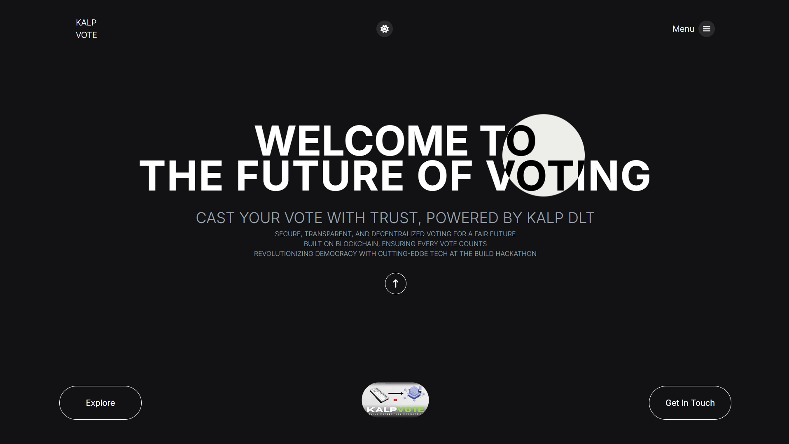

# KALP-VOTE : The Decentralized Voting Application 🎉



This is a **decentralized voting application** built using **Next.js** on the frontend and **Kalp Studio blockchain technology** to securely manage and track votes. The app allows users to cast votes for candidates, retrieve real-time results 📊, and ensures transparency 🔍 and immutability 🔐 in voting transactions through the use of Kalp Studio's **Distributed Ledger Technology (DLT)**.

## Project Overview 🚀

This project leverages **Kalp Studio's DLT** for secure, transparent, and immutable voting transactions. The backend, powered by Kalp’s blockchain network, securely manages the voting process, while the frontend built with Next.js interacts with Kalp’s API to handle vote submissions and result retrieval. To ensure a smooth user experience, the app uses the blockchain ledger to retain vote counts, ensuring persistence even after page reloads.

## Key Features 🌟

- 🔗 **Blockchain Integration:** Utilizes **Kalp Studio's API** to record votes and fetch real-time results, ensuring a secure, tamper-proof election process.
- 🔄 **Persistent Voting:** Vote counts are retained through session cookies, ensuring votes aren’t lost even if the page is reloaded.
- ✨ **Smooth Animations:** Custom scroll animations, including `ScrollViewSplits` and `ReverseScrollViewSplits`, provide a modern and engaging user experience.
- 📈 **Real-time Results:** Users can retrieve up-to-date vote counts instantly through the blockchain.

## Kalp Studio Integration ⚙️

The application is integrated with **Kalp Studio's blockchain technology** on both the backend and frontend:

- 🖥️ **Backend:** Manages voting transactions and securely stores votes within Kalp’s blockchain network.
- 🌐 **Frontend:** Interacts with Kalp Studio’s API to cast votes and fetch real-time results. The `ScrollViewSplits` and `ReverseScrollViewSplits` components utilize Kalp Studio's API endpoints for voting and result tracking.

## API Endpoints 📡

- 🔵 **/Invoke/MintVote:** This endpoint is used to submit votes for a candidate, ensuring the transaction is recorded on the Kalp blockchain.
- 🔵 **/Invoke/GetCandidate:** Fetches real-time vote counts from Kalp's blockchain network, allowing for immediate and transparent results.

## Getting Started 🏁 

To get started with the project, follow these steps:

1. Clone the repository:
    ```bash
    https://github.com/NK-Works/Kalp-Vote.git
    ```

2. Install the dependencies:
    ```bash
    npm install
    ```
    or
    ```bash
    yarn install
    ```

3. Run the development server:
    ```bash
    npm run dev
    ```
    or
    ```bash
    yarn dev
    ```

4. Open [http://localhost:3000](http://localhost:3000) in your browser to see the project in action. You can start editing the page by modifying `app/page.tsx`, and the page will auto-update as you edit the file ✨.

## Screenshots 📸

Here are some key screenshots from the application to illustrate its features:

### Voting Page 🗳️


### Modern UI 🎨


## Learn More 📚

To learn more about the technologies used in this project:

- **[Next.js Documentation](https://nextjs.org/docs):** Learn more about Next.js features and API for building modern web applications.
- **[Kalp Studio Documentation](https://docs.kalp.studio/):** Learn more about integrating Kalp Studio's Distributed Ledger Technology (DLT) with your applications.

## Deployment 🚀

The easiest way to deploy your Next.js application is by using **Netlify** or **Vercel**. For more information on deploying your app, check out the official [Next.js deployment documentation](https://nextjs.org/docs/deployment) 🌍.

## Project Structure 🗂️

- **Frontend:** Built using the React library and Next.js, offering a responsive and modern user experience 🖥️.
- **Smart Contracts:** Developed using **Kalp SDK** and **GoLang**, managing the core voting logic and interaction with the blockchain ⚙️.

Enjoy the seamless, transparent, and secure voting experience of KALP-VOTE! 🗳️

Consider 🌟 the repository to show some love 🙏
