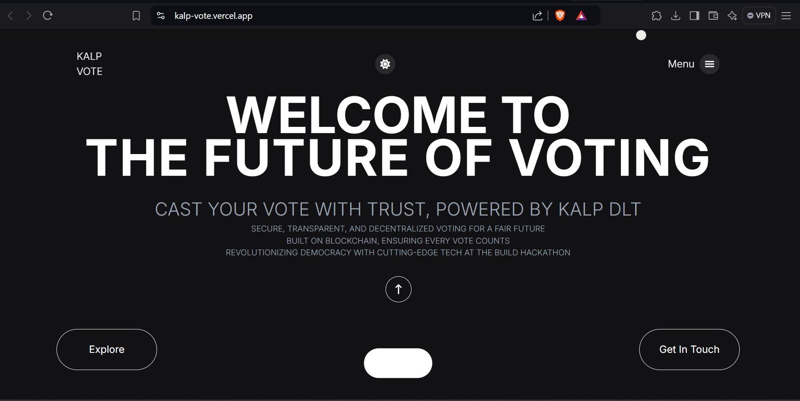
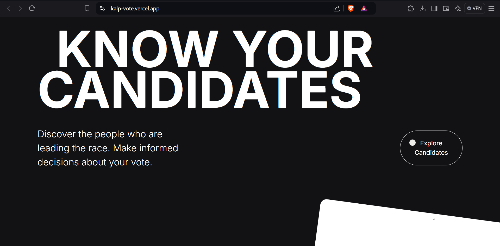

# Blockchain-based Voting Application

This is a decentralized voting application built using [Next.js](https://nextjs.org/) on the frontend and [Kalp Studio](https://kalp.studio/) blockchain technology to securely manage and track votes. The app allows users to cast votes for candidates, retrieve real-time results, and ensures transparency and immutability in voting transactions through the use of Kalp Studio's Distributed Ledger Technology (DLT).

## Project Overview

This project leverages Kalp Studio's DLT for secure and transparent voting transactions. On the backend, we manage voting through Kalp’s blockchain network. The frontend interacts with the Kalp API to handle vote submissions and fetch results, with votes retained even after page reloads through the use of session cookies.

## Key Features

- **Blockchain Integration:** Utilizes Kalp Studio's API to record votes and fetch real-time results.
- **Persistent Voting:** Session cookies retain vote counts, ensuring that votes aren't reset upon reloading the page.
- **Smooth Animations:** Custom scroll animations in components like `ScrollViewSplits` and `ReverseScrollViewSplits`.
- **Cross-platform:** The app is optimized for web, Android, and iOS deployment.

## Kalp Studio Integration

- **Backend:** Manages voting transactions and vote storage.
- **Frontend:** In the `ScrollViewSplits` and `ReverseScrollViewSplits` components, Kalp Studio’s API endpoints `/Invoke/Vote` and `/Invoke/GetResults` are used to cast votes and retrieve results respectively.

## API Endpoints

- **/Invoke/Vote:** Used to submit votes for a candidate.
- **/Invoke/GetResults:** Fetches real-time vote counts from the Kalp blockchain.

## Getting Started

First, run the development server:

```bash
npm install
npm run dev
# or
yarn dev
# or
pnpm dev
# or
bun dev
```

Open [http://localhost:3000](http://localhost:3000) to see the project in action.

You can start editing the page by modifying \`app/page.tsx\`. The page auto-updates as you edit the file.

This project uses [\`next/font\`](https://nextjs.org/docs/basic-features/font-optimization) to automatically optimize and load Inter, a custom Google Font.

## Screenshots

Include relevant screenshots of your app showing candidate selection, voting interactions, and the vote count retrieval.

- Landing Page  
  

- Modern UI  
  

## Learn More

To learn more about Next.js, take a look at the following resources:

- [Next.js Documentation](https://nextjs.org/docs) - Learn about Next.js features and API.
- [Kalp Studio](https://kalp.studio/docs) - Learn about integrating Kalp DLT with your apps.

## Deployment

The easiest way to deploy your Next.js app is using [Vercel](https://vercel.com/new?utm_medium=default-template&filter=next.js&utm_source=create-next-app&utm_campaign=create-next-app-readme).

Check out [Next.js deployment documentation](https://nextjs.org/docs/deployment) for more details.

